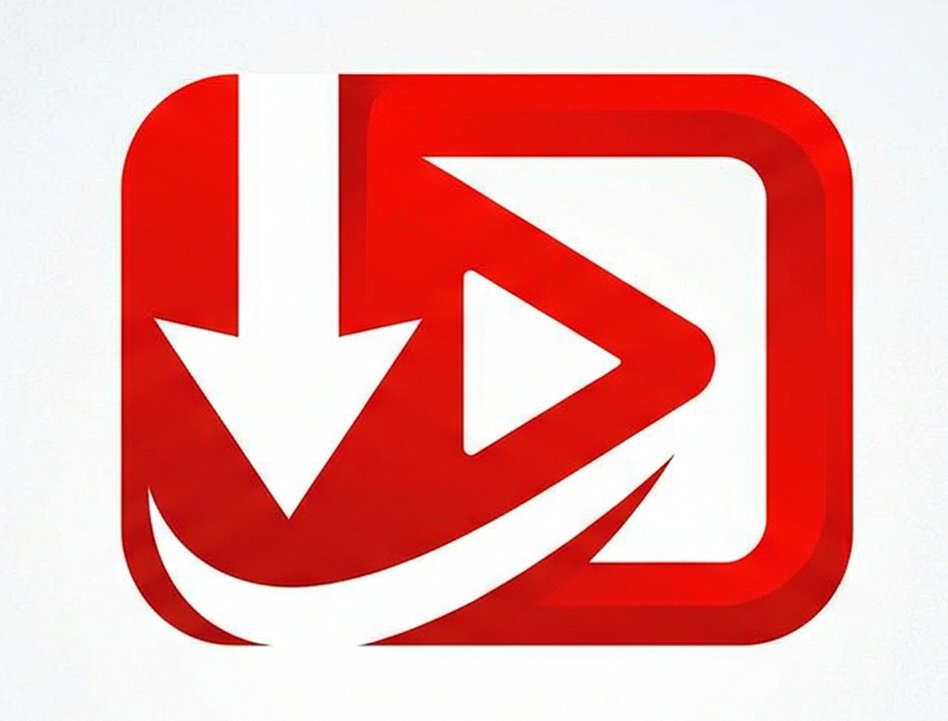
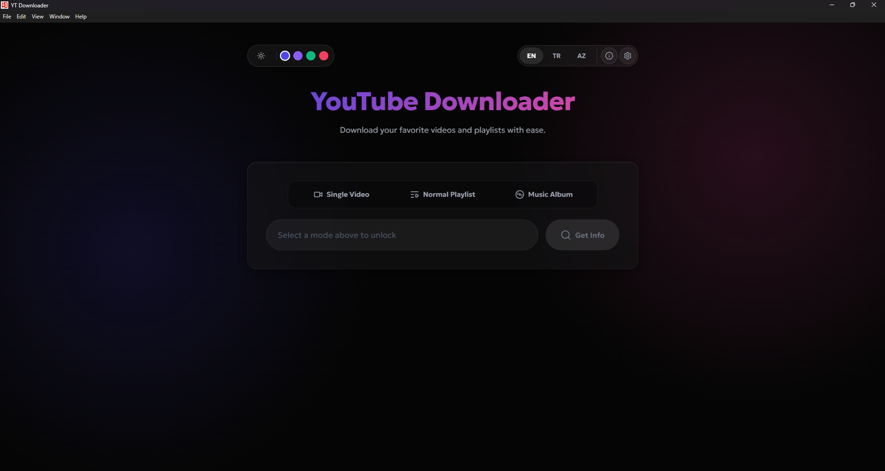
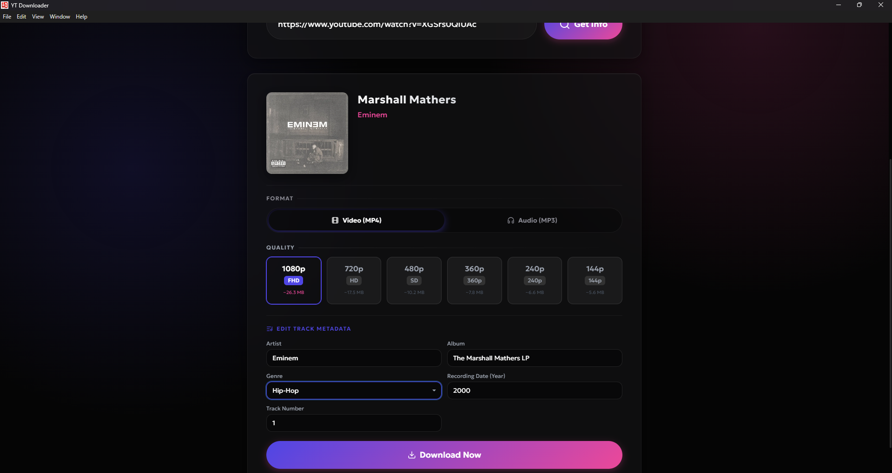
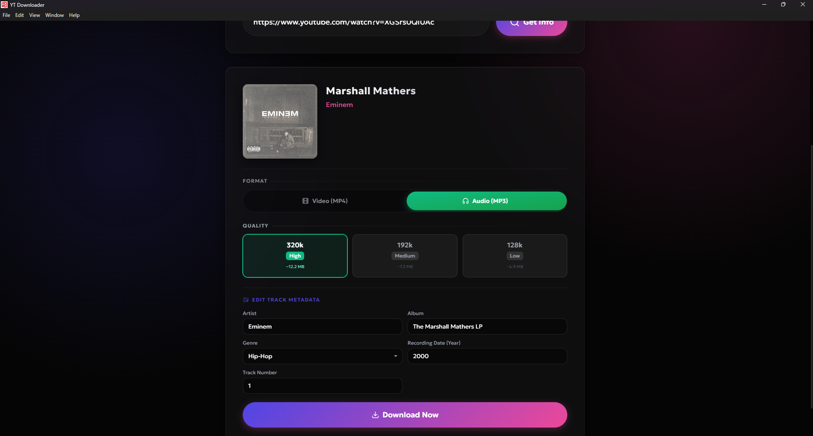
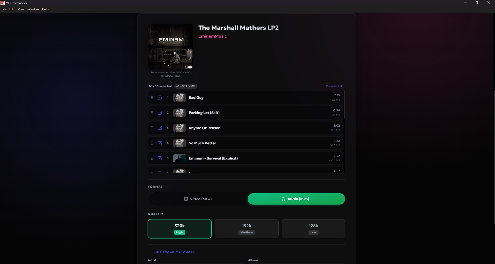

<p align="center">
  
</p>

<h1 align="center">YT Downloader</h1>

<p align="center">
  <strong>A sleek and powerful YouTube video & music downloader</strong><br>
  Download as MP4 (1080p → 360p) or MP3 (320kbps → 128kbps). Full playlist & album support.
</p>

<p align="center">
  <a href="https://github.com/SahibAlibabayev/YT-Downloader-Album/releases/latest">
    
  </a>
  
  
</p>

---

## ✨ Features

| Feature | Details |
|---------|---------|
| 🎬 **Video Download** | Quality selection: 1080p, 720p, 480p, 360p |
| 🎵 **Music Download** | MP3 at 320kbps, 192kbps, or 128kbps |
| 📀 **Album & Playlist** | Full playlist/album download with individual track selection |
| 🔀 **Drag & Drop Reorder** | Spotify-style animated track reordering |
| 🎨 **ID3 Metadata** | Artist, Album, Genre, Year, Cover Art |
| 🖼️ **Custom Cover Art** | Upload your own album artwork |
| 🌍 **Multi-Language** | English, Turkish, Azerbaijani |
| 🎨 **Theme Palette** | 8 different color themes with dark mode |
| 📋 **Context Menu** | Native right-click Cut / Copy / Paste support |

## 📸 Screenshots

<p align="center">
  
  
</p>
<p align="center">
  
  
</p>

## 📥 Installation

### For Users (Ready-to-Use Installer)
1. Download `YT.Downloader.Setup.1.0.0.exe` from the [**Releases**](https://github.com/SahibAlibabayev/YT-Downloader-Album/releases/latest) page
2. Run the installer and complete the setup
3. Launch the app from the desktop shortcut

### For Developers (From Source)

#### Requirements
- Node.js v18+
- PowerShell (Windows)

#### Steps

```bash
# 1. Clone the repo
git clone https://github.com/SahibAlibabayev/YT-Downloader-Album.git
cd YT-Downloader-Album

# 2. Install dependencies
npm install
cd frontend && npm install && cd ..

# 3. Download bundled Python & FFmpeg (REQUIRED)
npm run setup-resources

# 4. Run in development mode
npm run electron:dev

# 5. Build the installer (.exe)
npm run electron:build
```

> The finished installer will be located in the `dist-electron/` folder.

## 🏗️ Architecture

```
yt-downloader/
├── frontend/          # React + Vite + Tailwind CSS
│   └── src/
│       ├── components/   # UI components
│       ├── locales/      # i18n translations (en, tr, az)
│       └── services/     # API layer
├── backend/           # Python Flask + yt-dlp
│   ├── app.py            # Flask server
│   └── downloader.py     # Download engine
├── electron/          # Electron main process
│   ├── main.js           # BrowserWindow + Flask spawn
│   ├── preload.js        # IPC bridge
│   └── settings.js       # electron-store
└── build-assets/      # Icons and build resources
```

## 🛠️ Tech Stack

- **Frontend:** React 19, Vite, Tailwind CSS, Framer Motion, Lucide Icons
- **Backend:** Python, Flask, yt-dlp, FFmpeg, Mutagen
- **Desktop:** Electron, electron-builder (NSIS)
- **i18n:** i18next (EN / TR / AZ)

## 📄 License

MIT © Sahib Alibabayev
